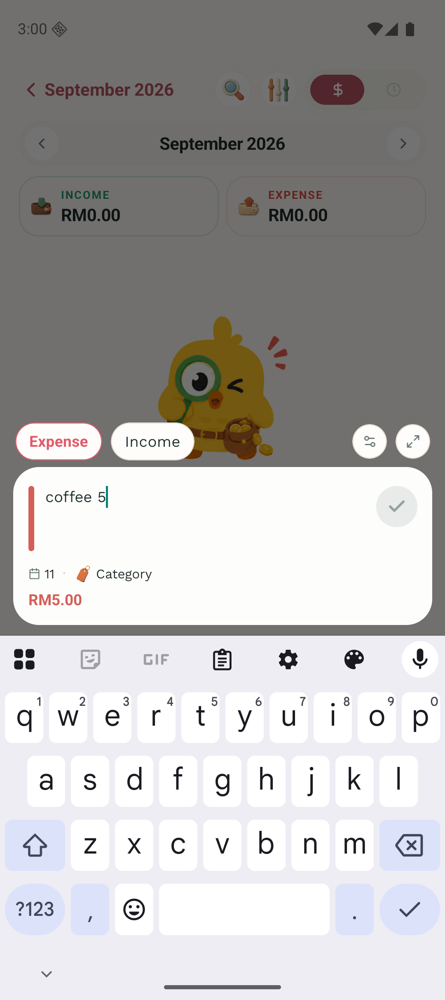
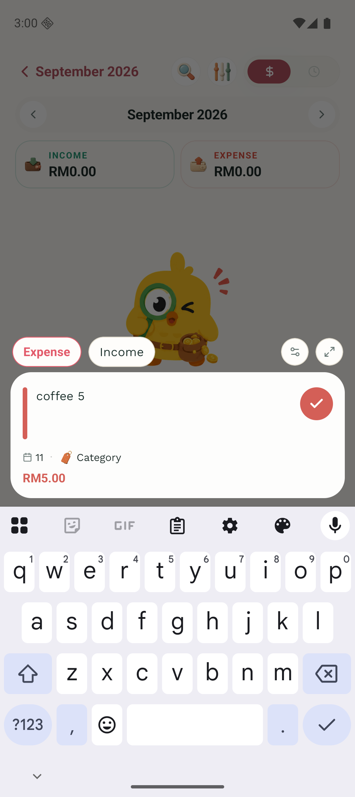
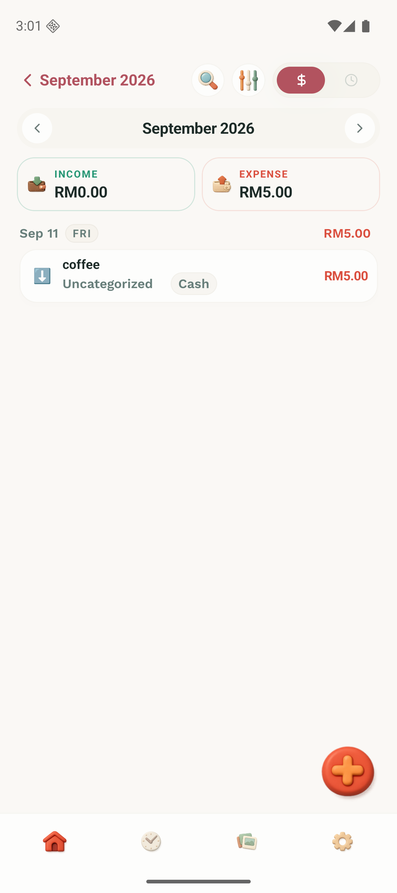

# Quick entry with a missing simple wallet

Verified on 2026-09-11 using a fresh Pixel 9 Android 16 (API 36, ARM64) emulator, a local development build, and synthetic data. No production backend or personal account data was used.

The fixture has simple mode enabled, MYR as the reporting currency, one Cash account in MYR, and no account named Simple Wallet. This is a state a Money Manager import can leave behind: the import replaces accounts while preserving the app's mode setting. The reported recording shows the amount being parsed and the account picker hidden, which is consistent with this state. The physical Samsung S23+ and Huawei Mate 20 were not available for testing.

1. With the original QuickAddSheet from the PR base, enter `coffee 5`. The amount reads RM5.00 and the accessibility tree reports Save as disabled.
2. Load the corrected component with the same fixture and text. Save becomes enabled.
3. Tap the tick. Quick entry closes, the calendar shows the expense, and a read of the emulator's SQLite data confirms exactly one expense with note `coffee`, amount `5`, currency `MYR`, and account `Cash`.

| Original                              | Fixed                            | Saved                              |
| ------------------------------------- | -------------------------------- | ---------------------------------- |
|  |  |  |

Additional UI checks: blank input and `coffee 0` both keep Save disabled. With Cash temporarily set to USD while reporting remains MYR and no entry currency is pinned, quick entry displays USD from the fallback account. Cash was then restored to MYR.

Automated verification: the new missing-wallet regression failed against the original account-selection rule, then passed with the fallback. Six account-selection cases cover missing wallets, normal simple-wallet priority, power-mode selection, and no-account states. The full suite passes with 115 suites and 1,828 tests. Type checking, lint, formatting, and the Android debug build also pass.
